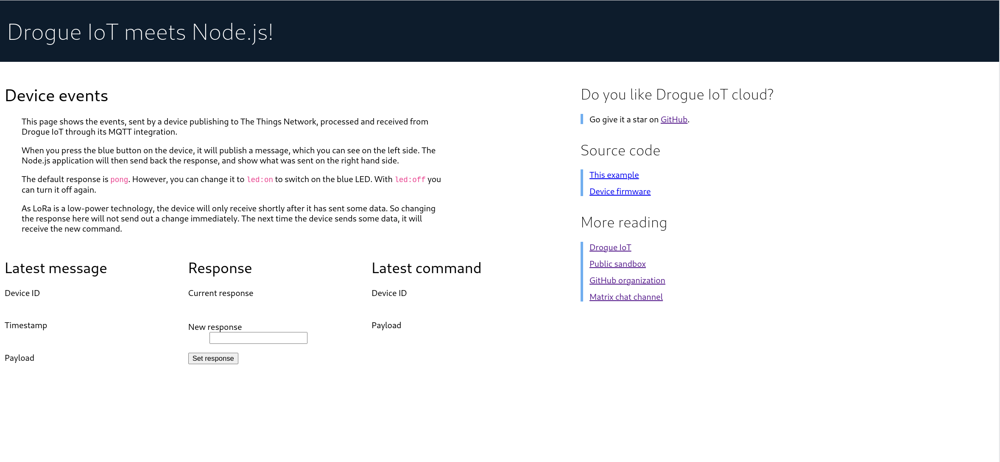
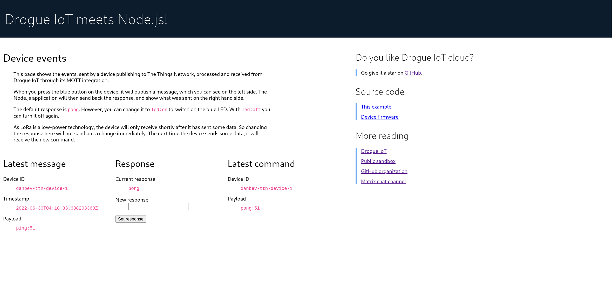

# Drogue IoT: Node.js MQTT integration example

[](https://github.com/drogue-iot/nodejs-mqtt-integration-example/actions?query=workflow%3A%22CI%22)
[](https://matrix.to/#/#drogue-iot:matrix.org)

This is an example of using the MQTT integration of [Drogue IoT][drogue] in
combination with [Node.js][nodejs] to implement the backend service for the
[LoRaWAN end-to-end][workshop] workshop.

## What does it do?

It is a small Node.js application, which connects to the MQTT integration
endpoint of Drogue IoT, and receives messages from devices that publish to
Drogue IoT Cloud.

It will parse messages and extract [TTN][ttn] (The Things Network) uplink
messages from that stream. When a TTN uplink message is received for port 1 and
with the payload is `ping`, then it will respond with the current active
response command.

The response will be sent back to the device using a downlink message.

***NOTE***: A downlink message will only be sent shortly after the uplink message was
received, as this is when the device expects it. Setting a new response command
will not send a new downlink message.

When you send `led:on` to the device, the blue LED should turn on. When you send
`led:off`, it should turn off again.

***NOTE***: There is a short time window, between the device sending and receiving. It
may happen that the downlink command takes a bit too long, and so it is
 delivered the next time the device connects.

## Configuration
The connection information required to connect to Drogue Cloud is specified
in the file `config_sample.json`. This file should be copied into `config.json`
and the following entries need to be updated:
```console
drogue.application.name=<application-name>
drogue.api.user=<user-name>
drogue.api.token=<api-access-token>
```
The `drogue.application name` is the name of the target application in Drogue
IoT Cloud to integrate with. The `drogue.api.user` is your Drogue IoT Cloud
username which can be found by logging in to Drogue Cloud and clicking on the
current user (a drop down button) which will have a field showing a field named
`username`.

For `drogue.api.token` use the API access token. If you have created API tokens
in the past you can see which ones exist using the following command:
```console
$ curl -s -H "Authorization: Bearer $(drg whoami --token)" https://api.sandbox.drogue.cloud/api/tokens/v1alpha1 | jq
```
Notice that these will not show any tokens, only the prefix (used to delete the
token, and the data it was created. If you don't have the token available any
more a new token can be created using:
```console
$ curl -vs -H "Authorization: Bearer $(drg whoami --token)" -XPOST https://api.sandbox.drogue.cloud/api/tokens/v1alpha1 | jq
```

### Node version
This example was tested using Node.js `v16.15.1`.

### Building
```console
$ npm install
```

### Running
```console
$ npm start

> nodejs-mqtt-integration-example@1.0.0 start
> node --no-warnings index.js

Server listening on http://0.0.0.0:8080
Connected to mqtts://mqtt-integration.sandbox.drogue.cloud
```

Open http://0.0.0.0:8080 in a browser and you will be presented with a user
interface which should look something like this:



Next, press the blue button on the device which will send an uplink message
to Drogue IoT Cloud.

Once you press the blue button on the board, you should see an incoming message,
and with that, an outgoing message too.




### Enabling MQTT debugging
```console
$ npm run start-debug
```

### Deploying to Kubernetes
This example can be deployed to a Kubernetes cluster. The following instructions
require Docker to be installed.

### Building an image
```console
$ npm run build-image
```

### Running the image locally
```console
$ npm run run-image
```

See [deploy](./deploy/README.md) for instructions about how to deploy this
application to Minikube.

[drogue]: https://drogue.io
[nodejs]: https://nodejs.org/en
[ttn]: https://www.thethingsnetwork.org/
[workshop]: https://book.drogue.io/drogue-workshops/ttn-lorawan-quarkus/index.html

